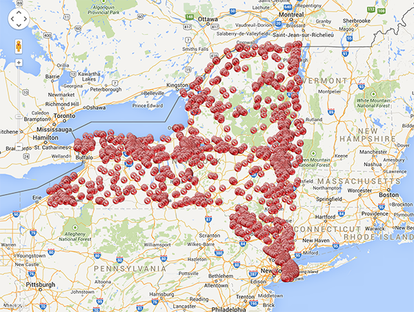
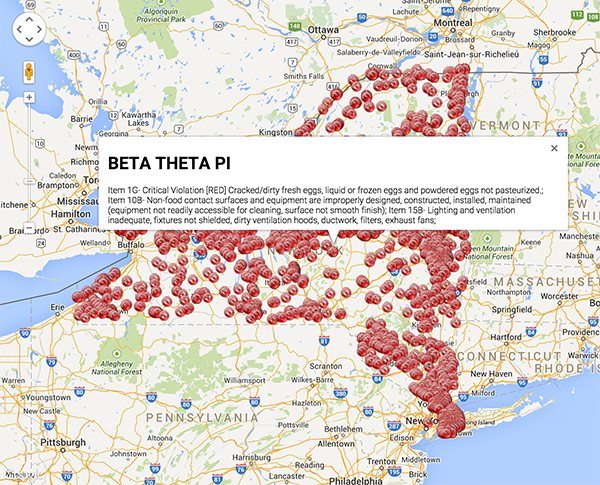

# NY State Food Service Inspection Failures

This project is a submission to [ChallengePost's 20js contest](http://20js.challengepost.com/). View the submission [here](http://20js.challengepost.com/submissions/33051-ny-state-food-service-inspection-failures).

Using 20 lines of JavaScript, I've written an Express app that plots the location of all food service violations in the state of New York. 

The app is up and running at [http://ny-food-violations.herokuapp.com/](http://ny-food-violations.herokuapp.com/). It takes 15-30 seconds to load, so be patient... it's processing around 4,000 inspections. 

## Routes

- `GET /` plots the location of all violations
- `GET /:zip` plots the location of all violations in a certain zip code. (slightly faster)

## Data

I'm using [data.gov](https://www.data.gov)'s "*Food Service Establishment: Last Inspection*" JSON dataset, available at [http://catalog.data.gov/dataset/food-service-establishment-last-inspection](http://catalog.data.gov/dataset/food-service-establishment-last-inspection)

I only plot location's with at least one "*Critical Violation*".

This dataset exclude inspections conducted in New York City, Suffolk County, and Erie Country.

## Resources

This app makes use of `express` for the server and `request` for the API request to data.gov.

On the "frontend", I'm using [Google Maps API](https://developers.google.com/maps/) to plot the locations.

The icons on the map are pulled from [http://findicons.com/icon/download/26276/cancel2/16/png](http://findicons.com/icon/download/26276/cancel2/16/png)

## Screenshots 

Here's a quick screenshot of the map it generates. 



When you click on a marker, an info window displays the name of the location and a description of the violation. 



## The Source Code

```js
var app = require('express')(); 
app.get('/:z?', function(req,res){ var r=0;
require('request')('https://health.data.ny.gov/api/views/cnih-y5dw/rows.json', 
function (er,re,b) {
	res.send("<head>\n<style>html, body, #canv {height: \
100%;margin: 0px;padding: 0px}</style>\n<script src='https://maps.googleapis.co\
m/maps/api/js?v=3.exp'></script>\n<script>\nfunction i(){ \nvar opt={ zoom: 7, \
center: new google.maps.LatLng(43,-74)};\nvar map=new google.maps.Map(document\
.getElementById('canv'),opt);\n"+JSON.parse(b).data.filter(function(x){ 
if(x[20] && x[13]){return (req.params.z?(x[20].trim()===req.params.z):1)
&&(x[12]!=="0")}else {return false }}).map(function(x){return "\nvar m"+(++r)+
" = new google.maps.Marker({position: new google.maps.LatLng(" + x[34][1] + "," 
+x[34][2]+"),map: map, icon:\"http://findicons.com/icon/download/26276/cancel2/\
16/png\"});\nvar i"+r+"=new google.maps.InfoWindow({content: \"<h1>"+x[8].trim()
.replace(/"/g, '\\\"')+"</h1>"+ x[11].replace(/"/g, '\\\"') +"\"});\ngoogle.\
maps.event.addListener(m"+r+",'click',function(){i"+r+".open(map,m"+r+");});"
}).join("\n")+"}google.maps.event.addDomListener(window,'load',i);</script>\n\
</head>\n<body>\n<div id=\'canv'></div>\n</body>"); }); 
});
app.listen(process.env.PORT || 3000);
```

## How It Works

In this section, I'll attempt to describe how each piece of the code works. I've expanded the code into a more readable format to clarify what's happening at each step. 

First, I setup and configure the Express server to listen to `GET /:zip?` requests.

```js
var app = require('express')(); 
app.get('/:z?', function(req,res){
...
}
app.listen(process.env.PORT || 3000);
```

Next, I pull in the JSON API:

```js
require('request')('https://health.data.ny.gov/api/views/cnih-y5dw/rows.json', 
function (er,re,b) {
...
}
```

I construct the HTTP response by creating a long string. The first and last piece of this HTML string set up the web page and the Google Map: 

```html
<head>
<style>
html, body, #canv {
	height:100%;
	margin: 0px;
	padding: 0px
}
</style>
<script src='https://maps.googleapis.com/maps/api/js?v=3.exp'></script>
<script>
function i(){ 
var opt={ 
	zoom: 7,
	center: new google.maps.LatLng(43,-74)
};
var map=new google.maps.Map(document.getElementById('canv'),opt);
...
}
google.maps.event.addDomListener(window,'load',i);
</script>
</head>
<body>
	<div id=\'canv'></div>
</body>
```

Finally, the middle of the string is where the action happens: 

```js
JSON.parse(b).data
	.filter(function(x){ 
		if(x[20] && x[13]){
			return (req.params.z?(x[20].trim()===req.params.z):1)&&(x[12]!=="0")}
		else { return false }
	})
	.map(function(x){
	return "\nvar m"+(++r)+ " = new google.maps.Marker({position: new google.maps.LatLng(" + x[34][1] + "," +x[34][2]+"),map: map, icon:\"http://findicons.com/icon/download/26276/cancel2/16/png\"});\nvar i"+r+"=new google.maps.InfoWindow({content: \"<h1>"+x[8].trim().replace(/"/g,'\\\"')+"</h1>"+ x[11].replace(/"/g, '\\\"') +"\"});\ngoogle.maps.event.addListener(m"+r+",'click',function(){i"+r+".open(map,m"+r+");});"
	})
	.join("\n")
```

In this block of code, I start by parsing the JSON response from the API request. Then I `filter` to include only requests with at least one food service violation. While doing that, I also filter by zipcode, if appropriate. 

Next I `map` over this new array to convert each element into a string. Each string contains the "frontend" code to create the marker and the info window. The code generated (for each data point on the map) looks something like:

```js
var m110 = new google.maps.Marker({position: new google.maps.LatLng(43.094001,-76.14727),map: map, icon:"http://findicons.com/icon/download/26276/cancel2/16/png"});
var i110=new google.maps.InfoWindow({content: "<h1>AMF Strike-N-Spare Lanes</h1>Item  2C-  Critical Violation [RED] Cooked or prepared foods are subject to cross-contamination from raw foods.; Item  4A-  Critical Violation [RED] Toxic chemicals are improperly labeled, stored or used so that contamination of food can occur.; Item  8E-   Accurate thermometers not available or used to evaluate refrigerated or heated storage temperatures; "});
google.maps.event.addListener(m110,'click',function(){i110.open(map,m110);});
```

Finally, I `join` all these strings together and send the response to the client.